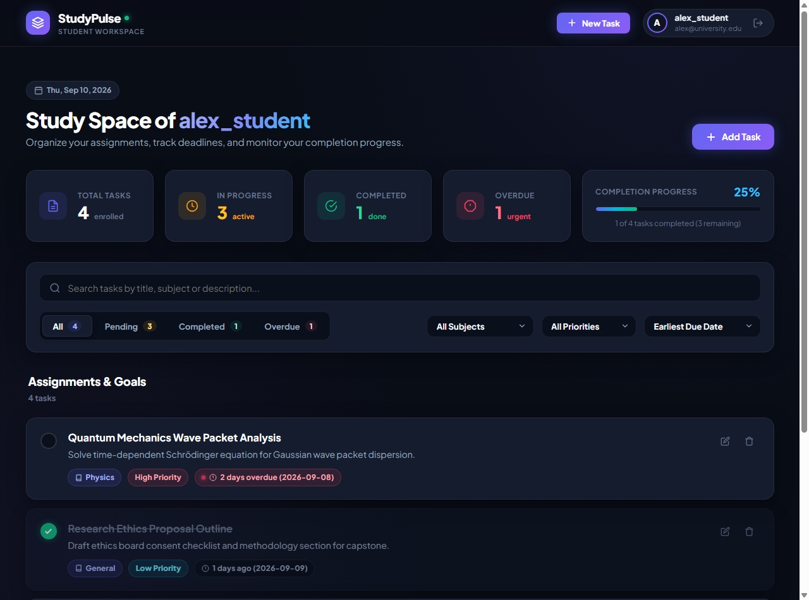
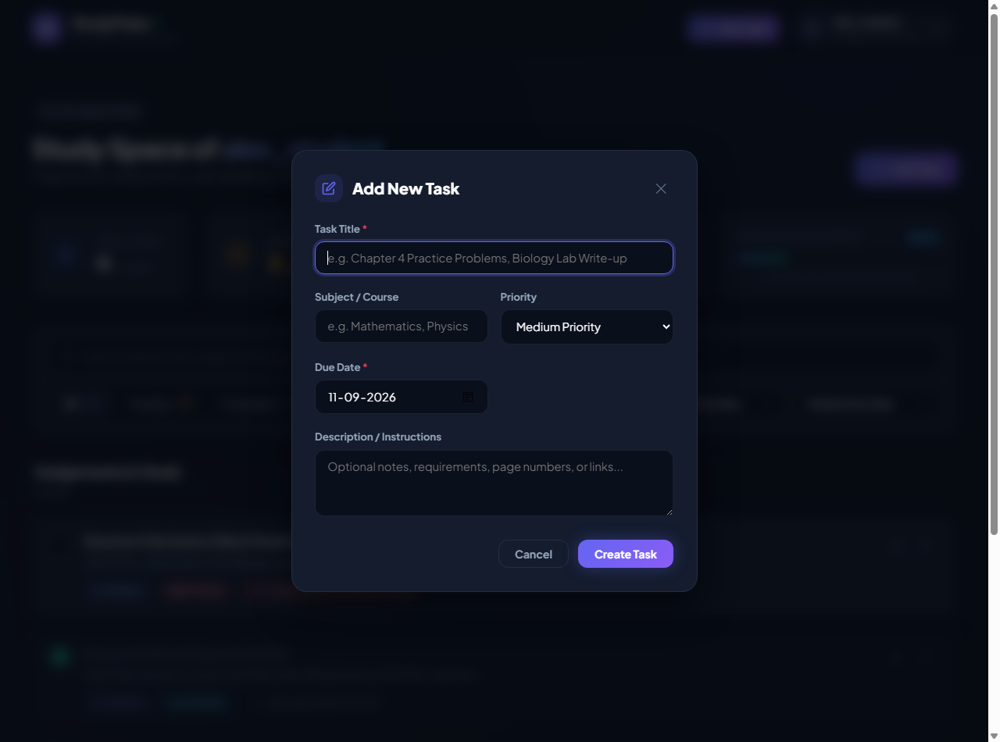
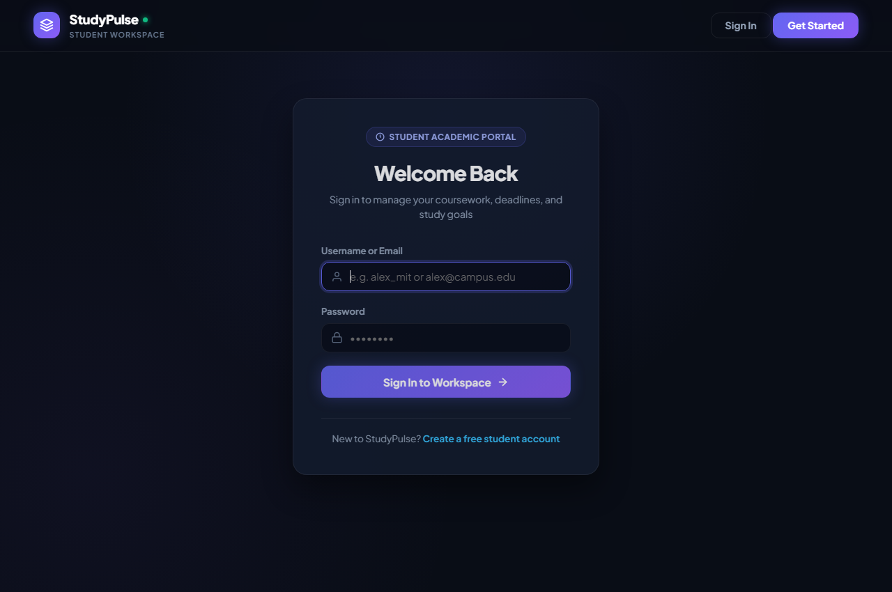

# 🎓 StudyPulse — Full-Stack Student Task & Deadline Manager

[](https://www.python.org/)
[](https://flask.palletsprojects.com/)
[](https://www.sqlite.org/)
[](https://developer.mozilla.org/en-US/docs/Web/JavaScript)
[](LICENSE)

A lightweight, full-stack student task and deadline management web application built with **Python Flask**, **SQLite**, and **Vanilla HTML5, CSS3, and JavaScript**.

🔗 **Repository Link**: [StudyPulse GitHub Repository](https://github.com/kaushikbuilds-cloud/inten)

---

## 📸 Application Preview

### Main Workspace Dashboard


<br>

<div align="center">
  
  
</div>

---

## 🎯 Project Overview

StudyPulse gives students a distraction-free, responsive workspace to organize course assignments, monitor upcoming deadlines, and track study progress. Every newly registered student starts with a clean workspace (no pre-populated dummy data) and can manage their own coursework organized by subject, priority, and due dates.

---

## ✨ Features

- **🔐 User Authentication & Session Security**:
  - Student registration and login with form validation.
  - Salted password hashing via Werkzeug (`generate_password_hash` / `check_password_hash`).
  - Session protection using `@login_required` decorators on all private views and REST API routes.
  - Safe session clearance upon logout.

- **📋 Task & Assignment Management (CRUD)**:
  - **Create Tasks**: Define Title, Course/Subject (e.g. Mathematics, Computer Science, Physics), Priority (Low, Medium, High 🔥), Due Date, and optional instructions or notes.
  - **Mark as Completed**: Direct circular check toggle on each card that immediately transitions task state between *Pending* and *Completed* via asynchronous Fetch API calls without a page reload.
  - **Edit Tasks**: Modal dialog to modify title, subject, priority, deadline, description, and status.
  - **Delete with Confirmation**: Safeguard modal requiring confirmation before removing a task permanently.

- **⏰ Smart Deadlines & Overdue Detection**:
  - Dynamically computes human-readable relative due dates (*"Due today"*, *"Due tomorrow"*, *"In 3 days"*, or *"2 days overdue"*).
  - Overdue pending assignments automatically trigger a danger chip with an animated pulsating alert dot.

- **📊 Clear Study Analytics**:
  - **Total Tasks**: Total count of enrolled assignments.
  - **Pending Tasks**: Count of tasks currently in progress.
  - **Completed Tasks**: Count of finished assignments.
  - **Overdue Tasks**: Count of overdue pending assignments.
  - **Completion Progress (%)**: Calculated as `(Completed Tasks / Total Tasks) × 100` and visualized through an animated linear progress bar.

- **🔍 Multi-Criteria Search & Filtering**:
  - **Live Search**: Debounced search input filtering across task titles, subjects, and descriptions in real time.
  - **Status Tabs**: Instant tab switching across *All*, *Pending*, *Completed*, and *Overdue*.
  - **Subject Filter**: Dropdown dynamically populated from the student's active subjects.
  - **Priority Filter**: Filter by High, Medium, or Low priority.
  - **Sorting**: Sort by earliest due date, latest due date, priority, or recently created.

- **🎨 Modern Dark Theme Interface**:
  - Custom dark theme with deep obsidian backgrounds (`#090d16`), elevated card layers (`#141c2e`), and subtle borders.
  - Frosted-glass navigation bar with date chip and active session indicator.
  - Context-aware empty state welcoming new users to their fresh desk.
  - Floating toast notifications providing instant visual feedback.

---

## 🛠️ Technology Stack

| Layer | Technology | Purpose |
| :--- | :--- | :--- |
| **Backend** | Python 3.12, Flask 3.1 | Application routing, REST API endpoints, session handling |
| **Security** | Werkzeug 3.1 | Password hashing, verification, session cookie management |
| **Database** | SQLite3 | Relational data store with foreign keys and query indices |
| **Frontend Structure** | HTML5 (Jinja2) | Semantic, accessible templating |
| **Frontend Styling** | Vanilla CSS3 | Custom design system, CSS variables, glassmorphism, responsive grid |
| **Frontend Logic** | Vanilla JavaScript (ES6+) | Asynchronous Fetch API, dynamic DOM updates, modal management |

---

## 📁 Project Directory Structure

```
inten/
├── app.py                  # Main Flask app, routes & JSON API endpoints
├── auth.py                 # Authentication blueprint (register, login, logout, security)
├── database.py             # SQLite connection manager and schema initialization
├── schema.sql              # Database schema (users and tasks tables, indices)
├── requirements.txt        # Python package dependencies
├── .gitignore              # Excludes virtual environments, caches, and local databases
├── README.md               # Project documentation and setup guide
├── test_app.py             # Automated unit and integration test suite
├── verify_e2e.py           # Live HTTP end-to-end test script
├── docs/
│   └── screenshots/        # High-resolution application screenshots
│       ├── dashboard.png   # Main workspace dashboard preview
│       ├── modal.png       # Add / Edit task modal preview
│       ├── login.png       # Sign in page preview
│       └── register.png    # Registration page preview
├── templates/
│   ├── base.html           # Shared layout with navigation and toast containers
│   ├── login.html          # Dark-themed login page
│   ├── register.html       # Dark-themed registration page
│   └── dashboard.html      # Main task manager dashboard, analytics, and modals
└── static/
    ├── css/
    │   └── style.css       # Custom CSS design system, responsive layout, animations
    └── js/
        └── app.js          # Client async logic for CRUD, status toggling, and filtering
```

---

## ⚙️ Installation & Setup Guide

### 1. Clone the Repository
```bash
git clone https://github.com/kaushikbuilds-cloud/inten.git
cd inten
```

### 2. Create and Activate a Virtual Environment
On Windows:
```powershell
python -m venv .venv
.\.venv\Scripts\activate
```

On macOS / Linux:
```bash
python3 -m venv .venv
source .venv/bin/activate
```

### 3. Install Dependencies
```bash
pip install -r requirements.txt
```

### 4. Run the Application
```bash
python app.py
```

### 5. Access the Web App
Open your browser and navigate to:
**[http://127.0.0.1:5000](http://127.0.0.1:5000)**

---

## 🧪 Automated Testing

The repository includes both unit tests and end-to-end integration tests:

### Unit & Integration Test Suite
Tests user registration (asserting zero initial dummy tasks), CRUD operations, status toggles, and invalid login handling:
```bash
python test_app.py
```

### Live HTTP Verification
Simulates an end-to-end HTTP client session against the live server:
```bash
python verify_e2e.py
```

---

## 🔒 Version Control & .gitignore

This repository strictly excludes local runtime files, database files, and environment files:
- `.venv/` (Virtual environment)
- `__pycache__/` (Python bytecode cache)
- `*.db` (Local SQLite databases)
- `.env` (Environment secret configurations)
